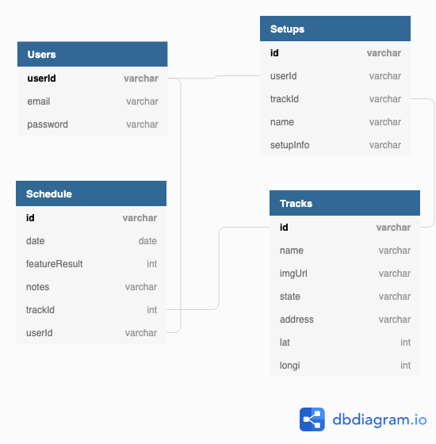

## Sprint Setup Pro
Sprint Setup Pro is a web application designed to help users manage a sprint car racing team. With this app you can create and edit car setups based on tracks that currently race at. You can also add your racing schedule to see what races are coming up, along with the weather information for your next race. Once a race is finished it autmatically shows up in the results section where you can log your result and include any notes you'd like to make about that race. In the results section you will aslo see a chart and table of all of your past race results based on year or all completed races. This app is intended to be a single point of reference for a sprint car to team to manage their team schedule and track setups as well as being a helpful tool to make setup decisions based on previous race results.

## Getting Started
1. Clone this repository to your computer
2. Run ```npm install```to install all packages
3. Run ```npm start```to start React

## Visit The Site On The Web
Sprint Setup Pro is also hosted on the web via Firebase. Go to https://sprintcarsetup-7a299.firebaseapp.com and enter the following information to see a sample user.

-Email: ryan@dm.com
-Password: cheesepita

## Technologies Used
-React
-Semantic UI
-Firebase Authenication
-Firebase Realtime Database
-Firebase Cloud Functions
-Moment JS
-Charts JS

## ERD
